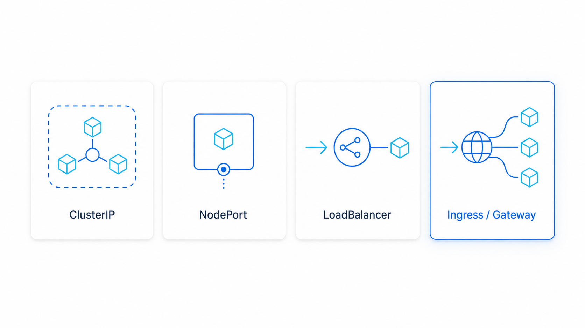
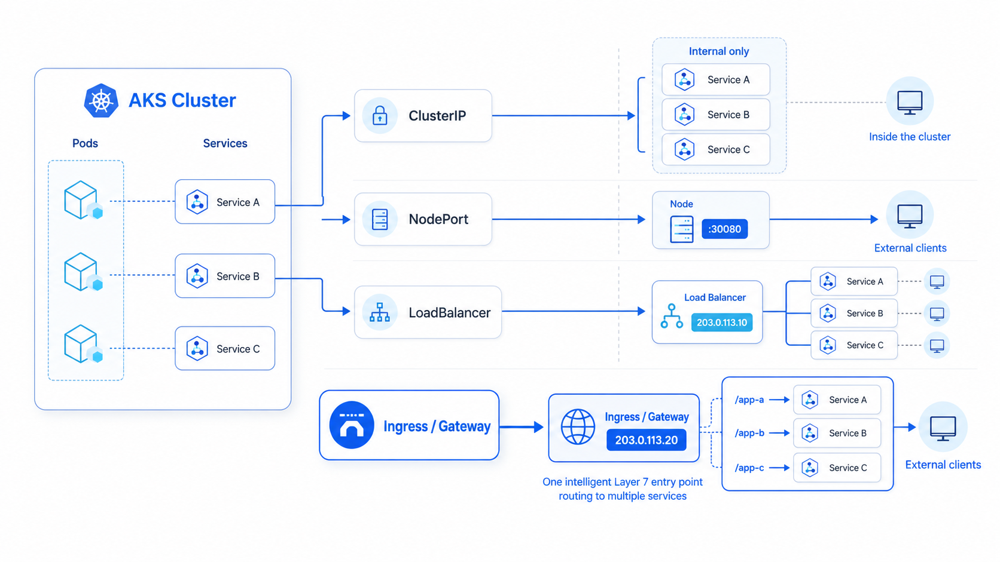
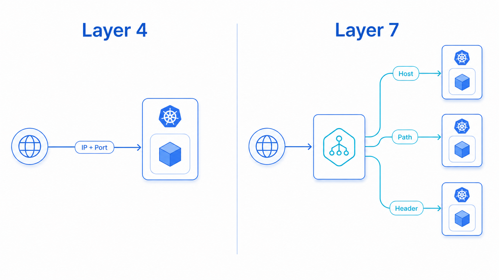
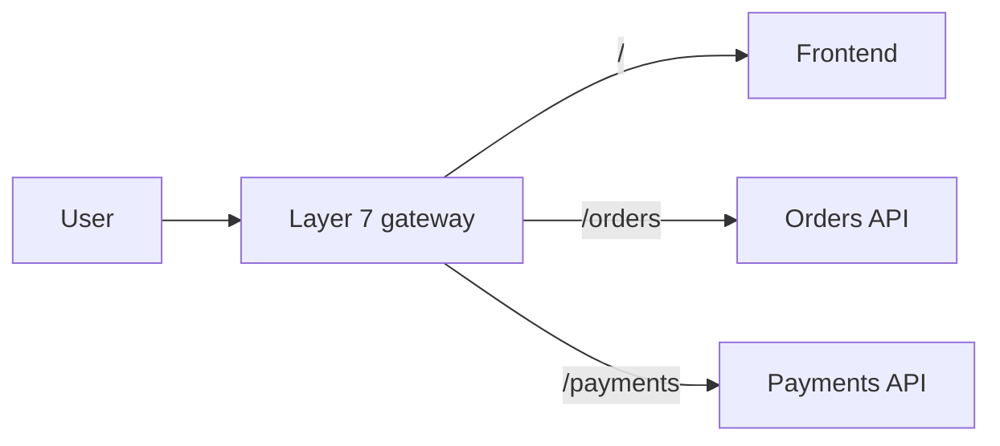
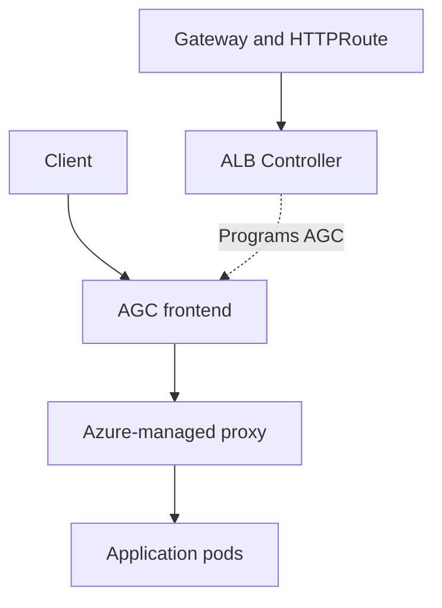
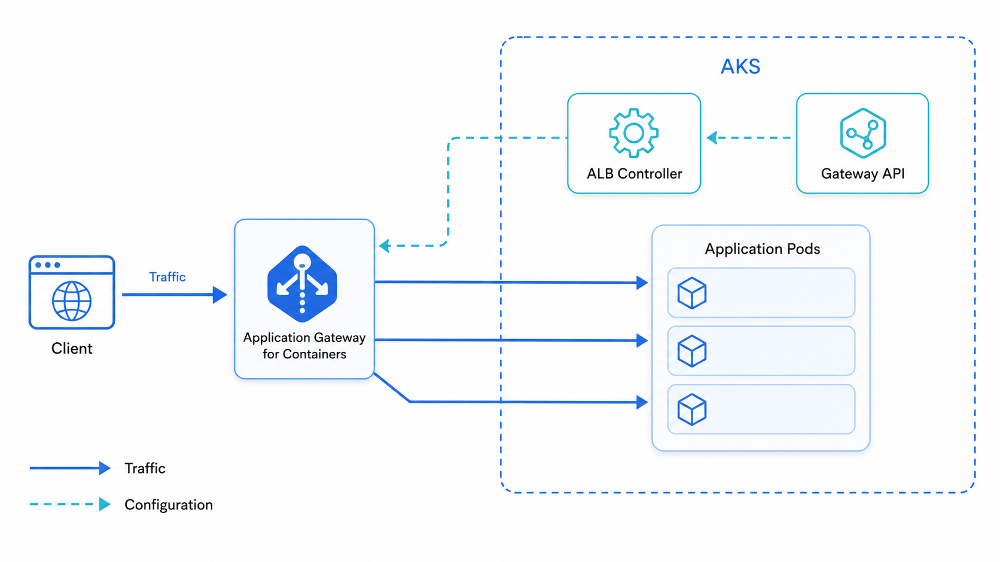
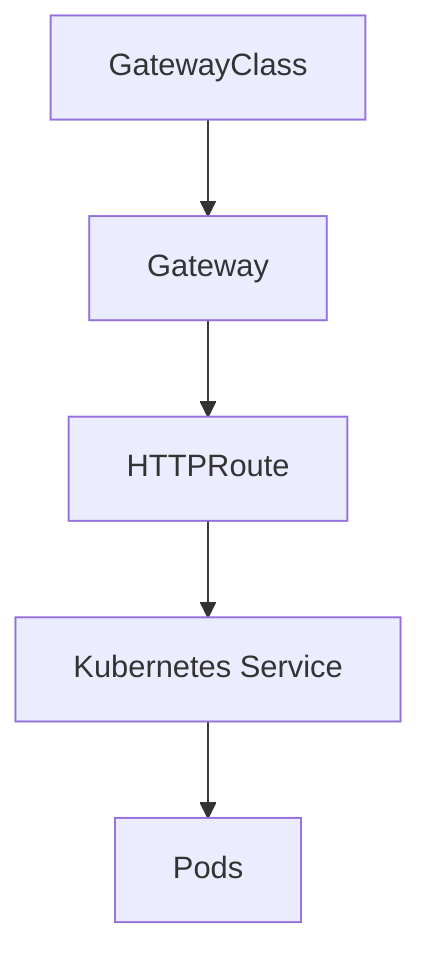
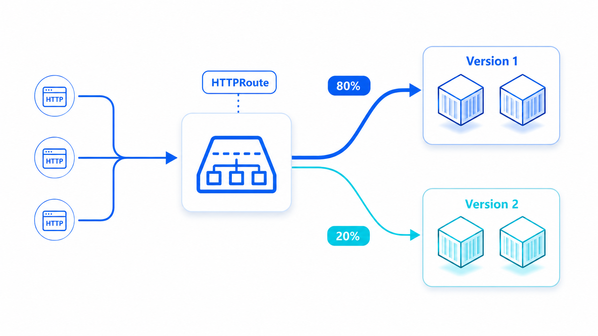

Your deployment completed successfully. The pods are running. Readiness probes are green. The Kubernetes Services exist, and everything works perfectly when tested from inside the cluster.

Then someone asks the deceptively simple question:

> *How will users actually reach this application?*

Running an application inside Kubernetes and exposing it safely are two different problems. Once traffic enters the picture—multiple microservices, hostnames, paths, certificates, application versions, security requirements—a basic public IP is no longer enough.

That is where Layer 7 traffic management becomes important. And for workloads running on Azure Kubernetes Service, Microsoft offers a container-focused answer: **Azure Application Gateway for Containers (AGC)**.

---

## How can we expose a Kubernetes application?

Suppose we deploy three applications to AKS:

```text
frontend
orders-api
payments-api
```

Each has its own Kubernetes `Service`:



```text
frontend-service
orders-service
payments-service
```

A Kubernetes Service makes a changing collection of pods available through a stable endpoint. How accessible that endpoint is depends on the Service type.

| Service type | Primary purpose |
|---|---|
| `ClusterIP` | Internal communication inside the cluster |
| `NodePort` | Exposes the Service through a port on every node |
| `LoadBalancer` | Requests an external or internal cloud load balancer |
| `ExternalName` | Maps the Service to an external DNS name |



`ClusterIP` is the normal choice for internal microservice communication. But if real users or external systems need access, we need an entry point into the cluster.

A straightforward option is:

```yaml
spec:
  type: LoadBalancer
```

On AKS, this creates an Azure Load Balancer with an external IP. This works—but it mainly solves a **Layer 4** networking problem.

---

## Layer 4 gets traffic inside. Layer 7 understands the request.

A Layer 4 load balancer works with:

- IP addresses
- TCP or UDP
- Ports
- Connections

It understands a rule like `Public IP:443 → Kubernetes Service:443`. What it does not understand is the application-level meaning of the request:

```text
/orders
/payments
api.example.com
X-Release: beta
?region=asia
```

Those details live at Layer 7, where HTTP and HTTPS operate.



A Layer 7 gateway makes much smarter decisions:

```text
shop.example.com/            → frontend-service
shop.example.com/orders      → orders-service
shop.example.com/payments    → payments-service
api.example.com              → api-service
X-Release: beta              → application-v2
```

This lets multiple applications share one controlled entry point while being routed independently.



---

## Why not expose every Service separately?

We technically could create a `LoadBalancer` Service for every application. As the environment grows, that design becomes difficult to operate.

We could end up with:

- Multiple public IP addresses with separate external endpoints for every Service
- Duplicated TLS configuration across the board
- A larger exposed attack surface
- More DNS and firewall rules to manage
- No shared path or hostname routing layer
- No convenient canary traffic management
- Difficult central security-policy enforcement

> [!warning]
> Application teams think in terms of URLs, routes, and versions. Exposing individual ports and IP addresses per service creates a growing operational mismatch as your microservice count increases.

For a small application, this may be acceptable. For a production microservice platform, you need a dedicated Layer 7 entry point.

---

## Where does Kubernetes Ingress fit?

Kubernetes provides an `Ingress` API for describing HTTP and HTTPS routes. But Ingress itself is **not** a load balancer—it's a configuration object, an expression of desired routing state.

An **Ingress controller** must watch that object and implement the actual traffic behavior:

```text
Ingress resource
      ↓
Ingress controller
      ↓
Real load-balancing infrastructure
```

Depending on the controller, that infrastructure could be NGINX, HAProxy, Traefik, an Azure Application Gateway, or another cloud load balancer.

> [!note]
> The original Ingress API is relatively simple. Advanced behavior often requires implementation-specific annotations, making configurations harder to understand and less portable across controllers. That limitation eventually led Kubernetes to design the **Gateway API**.

---

## Introducing Application Gateway for Containers

Azure Application Gateway for Containers—commonly shortened to **AGC**—is an Azure-managed Layer 7 load balancer and dynamic traffic management service designed for Kubernetes workloads.

It supports both the Kubernetes **Ingress API** and the **Gateway API**, and provides capabilities such as:

- Host and path-based routing
- Header and query-string matching
- Weighted traffic splitting (canary releases)
- URL redirects and rewrites
- Header modification
- Custom health probes
- TLS termination and end-to-end TLS
- Frontend and backend mTLS
- WebSockets and gRPC
- Session affinity
- Web Application Firewall (WAF) protection
- Autoscaling and zone resiliency

> [!tip]
> Microsoft positions AGC as the evolution of the Application Gateway Ingress Controller (AGIC), with a new control plane and data plane designed around modern Kubernetes traffic management. See the [official AGC overview](https://learn.microsoft.com/en-us/azure/application-gateway/for-containers/overview) for the full feature matrix.

---

## AGC is not another ingress pod inside AKS

This is one of the most important architectural points.

The **ALB Controller** runs inside the AKS cluster. However, the actual Application Gateway for Containers **data plane is Azure-managed and exists outside the cluster's pod network**.



There are two separate paths here.



### The control path

Manages configuration—never touches application traffic:

```text
Gateway or Ingress resources
            ↓
      ALB Controller
            ↓
     Azure AGC configuration
```

### The data path

Carries application traffic—never passes through the ALB Controller:

```text
Client → AGC frontend → Azure-managed proxy → Application pod
```

> [!important]
> Application requests do **not** travel through the ALB Controller. The controller translates Kubernetes intent into Azure networking configuration; it is not the proxy serving your traffic.

---

## The main AGC components

### 1. Application Gateway for Containers resource

The parent Azure resource. It represents the overall gateway deployment and coordinates configuration.

### 2. Frontend

The entry point clients connect to. Represents the address through which the application becomes accessible and can support multiple application hostnames.

### 3. Association

Connects AGC with its delegated subnet and enables connectivity toward the AKS workloads.

```text
Application Gateway for Containers
├── Frontend
└── Association
    └── Delegated AGC subnet
        └── Connectivity to AKS pods
```

> [!warning]
> AGC requires a dedicated `/24` subnet and must currently exist in the **same virtual network** as the AKS cluster. Azure CNI and Azure CNI Overlay are supported. **Kubenet is not supported.** See [AGC networking requirements](https://learn.microsoft.com/en-us/azure/application-gateway/for-containers/container-networking).

---

## The ALB Controller's role

The ALB Controller runs in AKS and continuously watches the relevant Kubernetes resources.

When we define a route like `/orders → orders-service`, the controller discovers:

- The matching rule
- The referenced Kubernetes Service and its port
- The available backend pods
- The health and readiness of those endpoints

It then reconciles that desired state with Application Gateway for Containers. When pods scale up, scale down, or get replaced, the controller updates AGC accordingly. It follows the standard Kubernetes controller pattern:

```text
Observe → Compare → Reconcile
```

---

## Gateway API: a better language for traffic management

Gateway API separates infrastructure ownership from application routing more clearly than the original Ingress API.



- `GatewayClass` — identifies the gateway implementation
- `Gateway` — defines the entry point, listeners, ports, and hostnames
- `HTTPRoute` — defines how HTTP requests are matched and routed
- `Service` — represents the backend application

For example, an `HTTPRoute` could express:



```text
/orders                 → orders-v1
X-Release: beta         → orders-v2
?region=asia            → asia-service
80% of normal requests  → orders-v1
20% of normal requests  → orders-v2
```

This is where Gateway API becomes particularly interesting for canary releases and progressive delivery.

> [!note]
> Don't confuse **Kubernetes Gateway API** with **Azure API Management**. Gateway API is a Kubernetes API for configuring network traffic routing. API Management provides broader API lifecycle capabilities—subscriptions, developer portals, policies, and API product management.

---

## AGIC versus AGC

The names sound similar, but they represent different generations of Azure's Kubernetes ingress integration.

| Area | AGIC | Application Gateway for Containers |
|---|---|---|
| Azure resource | Traditional Application Gateway | Container-focused AGC resource |
| Primary Kubernetes model | Ingress | Gateway API and Ingress |
| Configuration mechanism | ARM-based App Gateway updates | New AGC control and data planes |
| Weighted traffic splitting | Not a core native feature | Supported |
| Gateway API | Not natively supported | Natively supported |
| Pod and route update speed | Comparatively slower | Near-real-time updates |
| Lifecycle | App Gateway managed separately | Controller-managed or BYO |

> [!important]
> AGC is not simply a renamed AGIC. It is a different architecture built specifically for Kubernetes application delivery.

---

## What happens to a request?

Consider this incoming request:

```http
GET /api/orders?region=asia HTTP/1.1
Host: shop.example.com
X-Release: beta
```

The full lifecycle:

1. DNS resolves the hostname to the AGC frontend
2. The client connects to AGC
3. AGC selects the matching listener
4. It evaluates the attached `HTTPRoute`
5. Hostname, path, headers, and query string are checked
6. A matching backend Service is selected
7. Unhealthy endpoints are excluded
8. Any configured traffic weights are applied
9. The request is forwarded to a healthy application pod
10. The response returns through AGC to the client

The result for this specific request:

```text
X-Release: beta
        ↓
HTTPRoute header match
        ↓
orders-v2 Service
        ↓
healthy v2 pod
```

That is Layer 7 traffic management expressed through Kubernetes resources and implemented by an Azure-managed data plane.

---

## Controller-managed or bring your own?

AGC supports two deployment approaches.

### Controller-managed

The ALB Controller manages the lifecycle of AGC and its related Azure resources based on Kubernetes configuration. This provides a Kubernetes-native experience and is useful when the platform team wants the gateway lifecycle driven from the cluster.

### Bring Your Own (BYO)

With BYO, the platform team provisions AGC, its frontend and association separately using Terraform, Bicep, Azure CLI, or the Azure portal. Kubernetes resources then reference that existing infrastructure.

An enterprise may prefer BYO when:

- Network infrastructure has a different owner
- Azure resources require strict governance
- Terraform or Bicep controls the infrastructure lifecycle
- Application teams should manage routes but not gateway resources
- Deleting a Kubernetes object must **not** delete shared infrastructure

> [!tip]
> Controller-managed deployment is convenient for learning and application-oriented environments. BYO often fits more naturally into larger enterprise operating models where the network team owns the gateway tier.

---

## How AGC is billed

AGC uses four billing meters—not a single flat rate.

| Meter | Illustrative hourly price (East US 2) |
|---|---|
| AGC resource | $0.017 |
| Frontend | $0.010 |
| Association | $0.120 |
| Capacity unit | $0.008 |

Capacity units are influenced by persistent connections and throughput. Enabling WAF uses higher WAF-specific rates.

> [!caution]
> Microsoft's illustrative example—one AGC resource, one frontend, one association, and five capacity units—works out to approximately **$136.51 for 730 hours** at those rates. Always check the [current regional pricing](https://learn.microsoft.com/en-us/azure/application-gateway/for-containers/understanding-pricing) before designing a production environment or leaving a lab running.

---

## The gateway is now part of the platform

Deploying containers is only one part of operating Kubernetes.

The moment an application needs to receive real traffic, the platform must answer several questions:

- Where does traffic enter?
- How is TLS handled?
- Which hostname or path reaches which Service?
- How are unhealthy pods removed from rotation?
- How can a new release receive only 10% of traffic?
- Where are security policies enforced?
- Who owns the gateway lifecycle?

A `LoadBalancer` Service can expose a port. An application-aware gateway can express **how the platform should deliver traffic**.

Application Gateway for Containers brings that Layer 7 behavior into the AKS ecosystem through Kubernetes-native APIs, while Azure manages the external data plane. For platform engineers, that is the interesting part: we can describe application-routing intent in Kubernetes without having to build and operate the complete external gateway data plane ourselves.

The pods were already running.

Now the platform knows how the right traffic reaches the right one.

---

## Related Posts

- [[devops/kubernetes-v1-37-sneak-peek|Kubernetes v1.37 Sneak Peek: What Platform Engineers Should Actually Care About]]
- [[devops/kubernetes-tls-certificate-management|Kubernetes TLS Certificate Management: How Cluster Certificates Work]]
