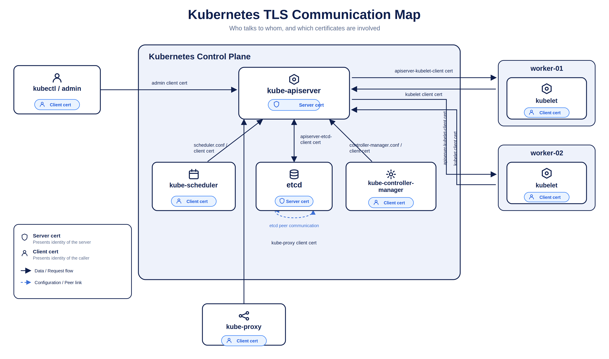
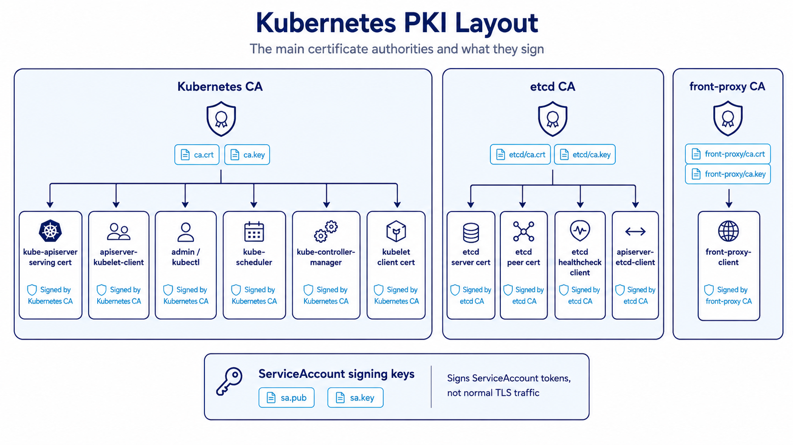
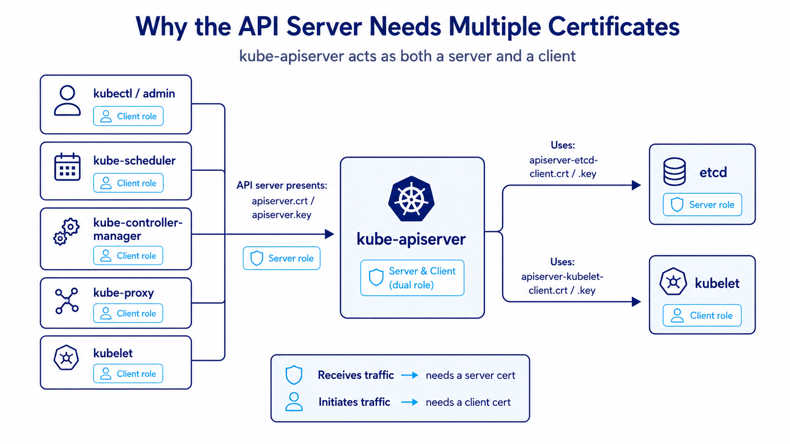
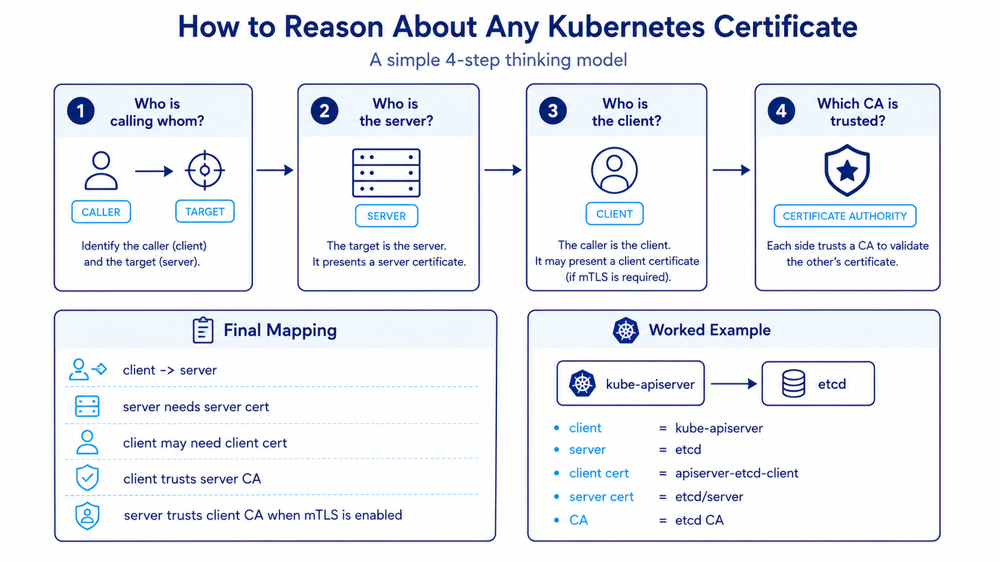

Walk into any self-managed Kubernetes cluster and sooner or later you end up staring at `/etc/kubernetes/pki`, wondering which certificate belongs to which component and why the API server seems to need so many of them.

That confusion is normal.

Kubernetes certificate management looks complicated at first because multiple components talk to each other in different directions, and TLS identity changes depending on who is acting as the client and who is acting as the server.

This article gives you the mental model that makes it click. We will cover the main certificate authorities, the certificates needed when provisioning a cluster from scratch, how those certificates are used between components, and the commands you can use to inspect and manage them.

## The simple mental model

The easiest way to think about Kubernetes certificates is this:

> [!important]
> If a component **receives HTTPS traffic**, it needs a **server certificate**.  
> If a component **initiates a connection**, it may need a **client certificate**.

Some components do both.

The best example is `kube-apiserver`:

- it acts as a **server** when `kubectl`, kubelet, scheduler, and controller manager connect to it
- it acts as a **client** when it connects to **etcd**
- it also acts as a **client** when it connects back to the **kubelet**

That is why the API server needs more than one certificate pair.



## TLS, PKI, and identity in Kubernetes

Kubernetes uses TLS for two main reasons:

1. **Encryption** — traffic is protected in transit
2. **Identity verification** — each side can prove who it is

Kubernetes commonly uses **X.509 certificates**.

```text
.crt = public certificate
.key = private key
```

The certificate is public identity.  
The private key proves ownership of that identity.

The most sensitive key in the cluster is the **CA private key**, because that key can sign new trusted certificates.

In mutual TLS, both sides can authenticate each other:

- the **server** presents a server certificate
- the **client** may also present a client certificate
- each side validates the certificate chain against a trusted CA

Kubernetes then separates **authentication** from **authorization**:

```text
TLS certificate proves identity
RBAC decides permission
```

For client certificate authentication, the certificate subject becomes important:

```text
CN = Kubernetes username
O  = Kubernetes group
```

For example:

```text
CN=system:node:worker-01
O=system:nodes
```

That is how a kubelet identifies itself to the API server.

## The certificate authorities in a Kubernetes cluster

In a kubeadm-style cluster, PKI files are typically stored under:

```bash
/etc/kubernetes/pki
```

The main certificate authorities and signing keys are:

| CA / Key Pair | Purpose |
|---|---|
| `ca.crt`, `ca.key` | Main Kubernetes CA. Signs most Kubernetes component certificates. |
| `etcd/ca.crt`, `etcd/ca.key` | Dedicated etcd CA. Signs etcd server, peer, and etcd client certificates. |
| `front-proxy-ca.crt`, `front-proxy-ca.key` | Used by the API aggregation layer. |
| `sa.pub`, `sa.key` | Signs ServiceAccount tokens. Not normal TLS traffic. |

> [!note]
> The ServiceAccount signing key pair is usually stored with the cluster PKI, but it is **not** a normal TLS certificate pair. It signs and verifies ServiceAccount tokens.



## What certificates do you need when provisioning a cluster from scratch?

If you are provisioning a control plane from scratch, these are the main certificate areas you need to account for.

### 1. Kubernetes CA

This is the root of trust for normal Kubernetes component certificates.

It signs certificates used by:

- `kube-apiserver`
- `kube-scheduler`
- `kube-controller-manager`
- admin access
- kubelet client identity
- API server to kubelet client identity

### 2. etcd CA

This CA is used only for etcd-related trust.

It signs:

- etcd server certificate
- etcd peer certificate
- etcd healthcheck client certificate
- API server to etcd client certificate

### 3. front-proxy CA

This CA is dedicated to the **Kubernetes API aggregation layer** (used by extension API servers like `metrics-server` or custom API services).

It signs:

- `front-proxy-client.crt`, `front-proxy-client.key` — used by `kube-apiserver` when it acts as an authenticating proxy to extension API servers

Here is the flow that explains why it needs its own CA:

1. `kubectl` sends a request for an aggregated API (e.g. `kubectl top nodes` -> `metrics.k8s.io`).
2. `kube-apiserver` terminates the user's connection and authenticates them (via OIDC, client cert, token, etc.).
3. `kube-apiserver` then proxies the request to the extension API server (`metrics-server`) using mTLS with `front-proxy-client.crt` and `front-proxy-client.key`.
4. `kube-apiserver` injects HTTP headers telling the extension API server who the original user was:
   - `X-Remote-User: <username>`
   - `X-Remote-Group: <groups>`
   - `X-Remote-Extra-<name>: <extra>`
5. The extension API server uses `--requestheader-client-ca-file` (`front-proxy-ca.crt`) to verify that the request came from a trusted API server proxy, and then trusts those `X-Remote-*` headers for authorization.

```text
client -> kube-apiserver -> extension API server (e.g. metrics-server)
          [authenticates user]   [validates proxy via front-proxy-ca]
```

### 4. ServiceAccount signing keys

These are used to sign ServiceAccount tokens and are logically separate from component TLS.

## Core component certificates

### kube-apiserver

The API server is the center of the cluster. Almost every major component talks to it.

As a **server**, it needs:

```text
apiserver.crt
apiserver.key
```

This is the certificate presented when clients connect to the Kubernetes API.

That certificate must include correct **Subject Alternative Names**.

Common SANs include:

```text
kubernetes
kubernetes.default
kubernetes.default.svc
kubernetes.default.svc.cluster.local
10.96.0.1                             # Kubernetes Service ClusterIP (first IP in serviceSubnet)
control-plane hostname
control-plane IP
load balancer DNS/IP (if configured)
127.0.0.1
```

> [!tip]
> In-cluster pods talk to the API server via the `kubernetes` Service (`https://kubernetes.default.svc` or directly to `https://10.96.0.1:443`). If `10.96.0.1` (or your custom service subnet's first IP) is missing from the SANs, in-cluster clients will fail TLS certificate verification.

As a **client**, the API server also needs additional certificates.

To connect to etcd:

```text
apiserver-etcd-client.crt
apiserver-etcd-client.key
```

To connect to kubelet:

```text
apiserver-kubelet-client.crt
apiserver-kubelet-client.key
```

To connect to aggregated/extension API servers:

```text
front-proxy-client.crt
front-proxy-client.key
```

That is the piece many people miss: the API server is not only a server. It is also a client in three distinct directions.



### etcd

etcd stores cluster state, so its certificate layout matters a lot.

It commonly needs these certificate sets.

For serving client traffic:

```text
etcd/server.crt
etcd/server.key
```

For peer-to-peer communication between etcd members:

```text
etcd/peer.crt
etcd/peer.key
```

For health checks:

```text
etcd/healthcheck-client.crt
etcd/healthcheck-client.key
```

The API server does not connect anonymously to etcd.  
It uses `apiserver-etcd-client.crt` and `apiserver-etcd-client.key`, signed by the **etcd CA**.

### kubelet

The kubelet also works in both directions.

When the **kubelet talks to the API server**, it uses a **client certificate**:

```text
/var/lib/kubelet/pki/kubelet-client-current.pem
```

This usually identifies the node as something like:

```text
CN=system:node:<node-name>
O=system:nodes
```

When the **API server talks back to the kubelet** for operations like logs, exec, attach, port-forward, or metrics, the kubelet acts as a **server**.

For that, it needs:

```text
/var/lib/kubelet/pki/kubelet.crt
/var/lib/kubelet/pki/kubelet.key
```

A good memory hook:

```text
kubelet client cert = kubelet -> API server
kubelet server cert = API server -> kubelet
```

> [!warning]
> In most default `kubeadm` setups, `/var/lib/kubelet/pki/kubelet.crt` is a **self-signed certificate** generated locally on the node—it is **not** signed by the cluster CA! This is the root cause behind common TLS errors when tools like `metrics-server` or `kube-apiserver` connect to kubelet. See the Gotchas section below for how to fix this with `serverTLSBootstrap`.

### admin, scheduler, controller manager, and kube-proxy

These mostly act as **clients** to the API server.

| Component | Credential | Purpose |
|---|---|
| admin / kubectl | `admin.conf` | Administrative access to the API server |
| kube-scheduler | `scheduler.conf` | Scheduler communicates with the API server |
| kube-controller-manager | `controller-manager.conf` | Controller manager communicates with the API server |
| kube-proxy | kube-proxy kubeconfig / cert | Watches cluster state through the API server |

> [!tip]
> Scheduler and controller manager do **not** normally talk directly to etcd.  
> They go through the API server.

## Full communication map

The communication flow looks like this conceptually:

```text
kubectl/admin -> kube-apiserver
kube-scheduler -> kube-apiserver
kube-controller-manager -> kube-apiserver
kube-proxy -> kube-apiserver
kubelet -> kube-apiserver

kube-apiserver -> etcd
kube-apiserver -> kubelet

etcd member -> etcd member
```

If you understand that direction map, certificate mapping becomes much easier.

## How to think about any Kubernetes certificate

Do not start by memorizing filenames.

Start with the communication path and ask four questions:

1. Who is calling whom?
2. Who is the server?
3. Who is the client?
4. Which CA should be trusted?



Then map it like this:

```text
client -> server
server needs server cert
client may need client cert
client must trust server CA
server must trust client CA if mTLS is enabled
```

Example:

```text
kube-apiserver -> etcd
client = kube-apiserver
server = etcd
client cert = apiserver-etcd-client.crt/key
server cert = etcd/server.crt/key
CA = etcd CA
```

Another example:

```text
kubelet -> kube-apiserver
client = kubelet
server = kube-apiserver
client cert = kubelet-client-current.pem
server cert = apiserver.crt/key
CA = Kubernetes CA
```

> [!important]
> This direction-first method is far more reliable than trying to memorize random filenames in isolation.

## Practical commands to inspect certificates

When working with cluster certificates, these are the most useful inspection commands.

Check expiration of kubeadm-managed certs:

```bash
kubeadm certs check-expiration
```

Inspect a certificate in full:

```bash
openssl x509 -in /etc/kubernetes/pki/apiserver.crt -text -noout
```

Check only expiry:

```bash
openssl x509 -in /etc/kubernetes/pki/apiserver.crt -noout -enddate
```

Check issuer:

```bash
openssl x509 -in /etc/kubernetes/pki/apiserver.crt -noout -issuer
```

Check subject:

```bash
openssl x509 -in /etc/kubernetes/pki/apiserver.crt -noout -subject
```

Check SANs:

```bash
openssl x509 -in /etc/kubernetes/pki/apiserver.crt -text -noout | grep -A1 "Subject Alternative Name"
```

Inspect the kubelet client certificate:

```bash
openssl x509 -in /var/lib/kubelet/pki/kubelet-client-current.pem -text -noout
```

List kubelet PKI files:

```bash
ls -l /var/lib/kubelet/pki/
```

## kubeadm commands for generation and renewal

If you are using kubeadm, these commands matter the most.

Generate all certificates during initialization:

```bash
kubeadm init phase certs all
```

Generate only the API server certificate:

```bash
kubeadm init phase certs apiserver
```

Generate the API server client certificate for kubelet communication:

```bash
kubeadm init phase certs apiserver-kubelet-client
```

Generate etcd-related certificates:

```bash
kubeadm init phase certs etcd-server
kubeadm init phase certs etcd-peer
kubeadm init phase certs etcd-healthcheck-client
kubeadm init phase certs apiserver-etcd-client
```

Renew all kubeadm-managed certificates:

```bash
kubeadm certs renew all
```

Renew specific certificates:

```bash
kubeadm certs renew apiserver
kubeadm certs renew apiserver-kubelet-client
kubeadm certs renew apiserver-etcd-client
```

Generate kubeconfig files:

```bash
kubeadm init phase kubeconfig admin
kubeadm init phase kubeconfig scheduler
kubeadm init phase kubeconfig controller-manager
```

## Static pod manifests and certificate flags

In kubeadm clusters, control plane components usually run as **static pods**.

Their manifests are typically stored in:

```bash
/etc/kubernetes/manifests/
```

Important files:

```bash
/etc/kubernetes/manifests/kube-apiserver.yaml
/etc/kubernetes/manifests/etcd.yaml
/etc/kubernetes/manifests/kube-scheduler.yaml
/etc/kubernetes/manifests/kube-controller-manager.yaml
```

Useful API server flags:

```text
--client-ca-file
--tls-cert-file
--tls-private-key-file
--etcd-cafile
--etcd-certfile
--etcd-keyfile
--kubelet-client-certificate
--kubelet-client-key
--requestheader-client-ca-file
--proxy-client-cert-file
--proxy-client-key-file
--service-account-key-file
--service-account-signing-key-file
```

Useful etcd flags:

```text
--cert-file
--key-file
--client-cert-auth
--trusted-ca-file
--peer-cert-file
--peer-key-file
--peer-client-cert-auth
--peer-trusted-ca-file
```

> [!tip]
> If you are ever unsure which certificate a component is actually using, check the static pod manifest flags first. They tell the truth.

## Common gotchas

### 1. Missing SANs on the API server certificate (including 10.96.0.1)

If the API server certificate does not contain the right DNS names or IPs, clients will fail TLS validation (`x509: certificate is valid for ..., not ...`).

This often happens when:

- the control plane endpoint IP/DNS changes or a load balancer is added later
- in-cluster pods connect via `10.96.0.1` (the default `kubernetes` Service ClusterIP), but the certificate SAN list omitted it
- the cluster was initialized without specifying `--apiserver-cert-extra-sans`

To fix an existing cluster, regenerate the API server certificate with extra SANs:

```bash
kubeadm init phase certs apiserver --apiserver-cert-extra-sans "api.k8s.example.com,192.168.1.100"
```

### 2. The self-signed kubelet serving certificate (the #1 metrics-server error)

By default, `kubeadm` provisions kubelet client certificates via the cluster CA, but leaves `/var/lib/kubelet/pki/kubelet.crt` as a **self-signed certificate** generated locally on each node.

When `kube-apiserver` (for `kubectl logs`/`exec`) or `metrics-server` connects to kubelet on port `10250` with TLS validation, you get:

```text
x509: cannot validate certificate for <node-ip> because it doesn't contain any IP SANs
# or
x509: certificate signed by unknown authority
```

The common temporary hack is to pass `--kubelet-insecure-tls` to `metrics-server`, but the proper production fix is:

1. Enable `serverTLSBootstrap: true` in the `KubeletConfiguration` (or via kubeadm config):
   ```yaml
   apiVersion: kubelet.config.k8s.io/v1beta1
   kind: KubeletConfiguration
   serverTLSBootstrap: true
   ```
2. When the kubelet starts, it requests a serving certificate via the `certificates.k8s.io` API.
3. **The catch**: While kubelet *client* CSRs are automatically approved by `kube-controller-manager`, kubelet *serving* CSRs are **not auto-approved by default** for security reasons (to prevent compromised nodes from spoofing arbitrary IPs). You must manually approve them:
   ```bash
   kubectl get csr
   kubectl certificate approve <csr-name>
   ```

### 3. Confusing ServiceAccount keys with TLS certs

`sa.key` and `sa.pub` are asymmetric RSA/ECDSA signing keys, **not** X.509 TLS certificates.

They sign and verify JWT tokens injected into pods at `/var/run/secrets/kubernetes.io/serviceaccount/token`. They do not secure HTTPS transport between cluster components.

### 4. Mixing the Kubernetes CA and etcd CA

This is the classic multi-node etcd mistake.

- Kubernetes component communication (apiserver, kubelet, scheduler, controller manager) is signed by `/etc/kubernetes/pki/ca.crt`
- etcd cluster communication and API-server-to-etcd client traffic is signed by `/etc/kubernetes/pki/etcd/ca.crt`

If you try to pass `ca.crt` instead of `etcd/ca.crt` to `--etcd-cafile`, `kube-apiserver` will immediately fail to start with `remote error: tls: bad certificate`.

## Summary

Kubernetes certificate management becomes much easier once you stop treating it as a list of filenames and start treating it as a set of communication paths.

The main ideas are:

- Kubernetes uses PKI and X.509 certificates for encryption and identity
- the main Kubernetes CA signs normal control plane and client certificates
- the etcd CA signs etcd-related certificates
- the API server needs both a serving certificate and multiple client certificates
- kubelet also has both a client identity and a serving identity
- the cleanest way to reason about any certificate is to identify the **client**, the **server**, and the **trusted CA**

If you can answer those three things for a connection path, most Kubernetes TLS questions become straightforward.

## Related Posts

- [[devops/azure-application-gateway-for-containers|Azure Application Gateway for Containers]]
