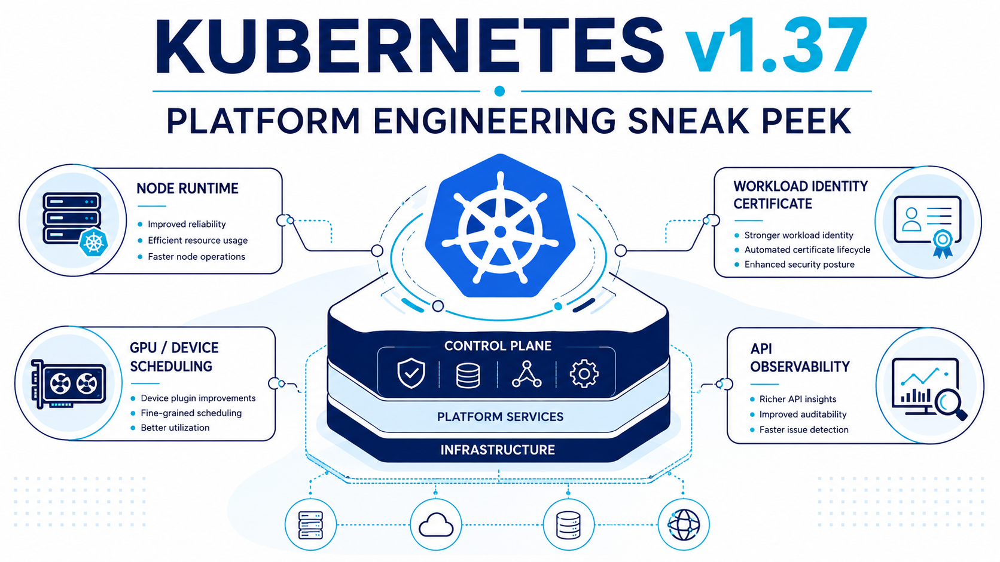
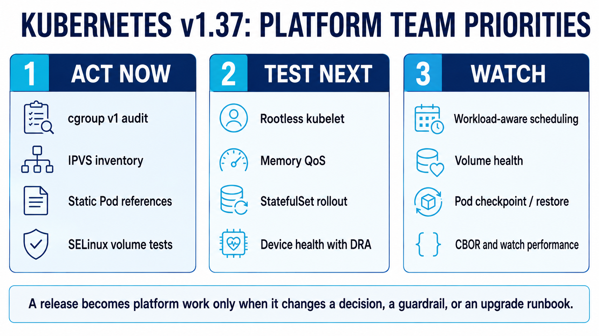
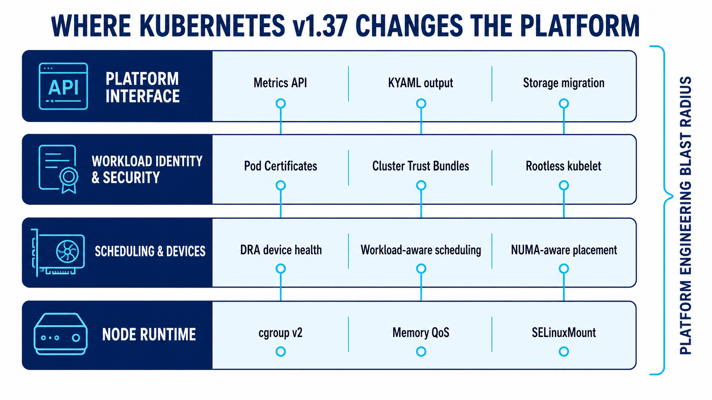

Kubernetes v1.37 is planned for **August 26, 2026**. The release is not defined by one spectacular feature. Its importance is spread across the layers platform teams own: node runtime assumptions, workload identity, resource management, device scheduling, API machinery, and upgrade safety.

That makes v1.37 easy to underestimate. A feature-by-feature recap produces a long list, but a platform team does not adopt a release note. It changes a node image, an API contract, a security control, an observability pipeline, or an upgrade runbook.

This preview therefore asks a different question: **which v1.37 changes should become platform work?** My answer is to split the release into three queues—act now, test next, and watch—then evaluate the architectural direction behind them.

> [!warning]
> This article was written on August 23, three days before the planned GA. Feature stages are **expected**, based on the official v1.37 sneak peek and enhancement tracking. Verify the final Kubernetes release notes before enabling a feature or approving a production upgrade.

## The short version

For most platform teams, Kubernetes v1.37 is less about exposing new features to developers and more about modernizing the substrate beneath the platform.

| Priority | Platform decision |
|---|---|
| **Act now** | Find cgroup v1 nodes, inventory `kube-proxy` IPVS usage, inspect static pod manifests, and test SELinux volume behavior where applicable. |
| **Test next** | Evaluate rootless kubelet, Memory QoS, StatefulSet rollout controls, workload identity primitives, and DRA device health in non-production clusters. |
| **Watch** | Follow workload-aware scheduling, pod checkpoint/restore, volume health, CBOR, and watch-path performance before turning them into platform promises. |



The practical theme is **capability consolidation**. Several long-running capabilities are expected to become stable, while beta and alpha work shows Kubernetes becoming more deliberate about workload identity, heterogeneous hardware, and large control-plane workloads.

## Act now: the upgrade work hidden inside the release

The highest-value release analysis usually starts with removals and changed defaults, not the new APIs.

### cgroup v1 is now operational debt

The critical question is not whether Kubernetes still has a compatibility switch. It is whether your fleet depends on it.

Since Kubernetes v1.35, `failCgroupV1` has defaulted to `true`. A kubelet on a cgroup v1 node will refuse to start unless the operator explicitly sets a temporary override. Meanwhile, newer resource-management work—including Memory QoS—assumes cgroup v2.

Check a node directly:

```bash
stat -fc %T /sys/fs/cgroup/
# cgroup2fs -> cgroup v2
# tmpfs     -> likely cgroup v1
```

For a managed fleet, the useful unit of analysis is not “the cluster.” It is every node pool, machine image, operating-system version, and bootstrap path. Old pools can retain an earlier cgroup mode even after the control plane has moved forward.

> [!caution] Treat the override as a bridge
> `failCgroupV1: false` buys migration time. It should not become the platform's permanent answer, because it preserves a runtime model that newer resource controls increasingly leave behind.

Platform action: add cgroup mode to node conformance checks and fleet inventory. A node should not join a supported pool unless its runtime contract is visible and validated.

### IPVS is a roadmap item, not an outage

The v1.37 preview starts the deprecation story for the `ipvs` mode of `kube-proxy`. The current plan is a warning in v1.37, disabled by default around v1.40, and removal around v1.43. That is intentionally a long runway.

Check whether a cluster explicitly selects it:

```bash
kubectl -n kube-system get configmap kube-proxy \
  -o jsonpath='{.data.config\.conf}' | grep 'mode:'
```

If your CNI replaces `kube-proxy`, this may be irrelevant. If you operate IPVS intentionally, use the warning window to test `nftables`, compare observability and network-policy interactions, and document kernel and node-image requirements.

The platform lesson is simple: a deprecation should enter the roadmap when announced, not when removal becomes imminent.

### Static pod API references are now rejected

Static pods are discovered from files by the kubelet; they are not created through the API server. References to Secrets or ConfigMaps were therefore an architectural contradiction, even if a bug allowed some forms to appear usable.

Kubernetes v1.37 is expected to reject those references strictly, with the previous opt-out removed. Control-plane static pod manifests are the obvious place to inspect:

```bash
grep -RniE 'secretRef|configMapRef|secret:|configMap:' \
  /etc/kubernetes/manifests/
```

Do not automate a blind rewrite. First identify why the static workload depends on an API-backed object, then replace that dependency with a delivery mechanism appropriate for a node-local manifest.

### SELinuxMount requires workload-shaped testing

The expected graduation of `SELinuxMount` is a meaningful storage performance improvement. Instead of recursively relabeling every file, Kubernetes can use mount-time SELinux labeling when a CSI driver advertises support.

The edge case matters: two pods with different SELinux labels sharing the same volume on one node may behave differently under mount-time labeling. Platform teams running SELinux and shared persistent volumes should test their actual tenancy pattern, not merely whether a single pod mounts successfully.

```bash
kubectl get csidriver \
  -o custom-columns=NAME:.metadata.name,SELINUX:.spec.seLinuxMount
```

Where needed, `seLinuxChangePolicy: Recursive` retains recursive behavior for a workload, trading startup performance for compatibility.

## Test next: features that can improve the platform contract

The next group is not automatically production-ready just because a gate is enabled or a KEP graduates. These features deserve experiments tied to a platform use case.

### Rootless kubelet strengthens the node boundary

Kubelet user-namespace support is expected to reach beta. The goal is to run node components so that they appear privileged inside a user namespace while mapping to unprivileged identities on the host.

This is defense in depth, not a claim that the kubelet becomes harmless. The integration surface includes the container runtime, CNI, CSI, host paths, device access, systemd, and operating-system configuration. A useful test matrix therefore needs realistic node add-ons and disruptive operations, not a single nginx pod.

For regulated or multi-tenant environments, the feature is strategically important: compromising a node agent should not automatically mean obtaining unrestricted host root. But platform teams should validate the whole node stack before making “rootless nodes” part of the platform's security story.

### Memory QoS makes cgroup v2 useful, not merely mandatory

Memory limits have historically been a blunt instrument: a container can run until it is killed, while reclaim pressure and noisy-neighbour behavior remain difficult to shape. Memory QoS uses cgroup v2 controls to provide more deliberate protection and throttling.

If the expected beta defaults hold, the right test is an application mix that includes bursty services, memory-sensitive stateful workloads, and node pressure. Observe reclaim latency, OOM behavior, eviction signals, and whether existing alert thresholds still make sense.

The important platform outcome is not “we enabled Memory QoS.” It is a supportable resource policy with known behavior under contention.

### StatefulSet rollout controls reduce manual intervention

`maxUnavailable` for StatefulSets is expected to advance to beta. It allows more than one replica to be unavailable during a rolling update, expressed as a count or percentage.

That can materially shorten upgrades for large stateful systems, but it does not know the application's quorum or replication semantics. A platform default that increases rollout parallelism without understanding failure domains could turn faster deployment into faster unavailability.

This belongs in workload-class templates: conservative defaults for quorum systems, higher parallelism for stateless-like StatefulSets, and policy checks where application owners opt into risk.

### Pod Certificates can simplify—but not magically solve—workload identity

Pod Certificates and Cluster Trust Bundles are expected to be among the maturing identity primitives. Together, they can provide short-lived X.509 credentials and distribute trust anchors through Kubernetes-native APIs and projected volumes.

This is valuable plumbing for mTLS, but it is not an identity architecture by itself. A platform still needs an issuer, authorization rules, naming conventions, rotation expectations, trust-domain boundaries, and application integration.

The correct evaluation is not “can this replace cert-manager or SPIFFE?” in the abstract. Compare concrete operating models: who issues, who attests, how trust is distributed, how revocation is handled, and what developers have to change.

### DRA is becoming an operational model for devices

Dynamic Resource Allocation reached a major milestone in earlier releases. v1.37 continues building the operational controls around it: expected stable device taints and tolerations, richer resource-claim status, and new work around compatibility groups, derived attributes, and NUMA information.

For GPU and high-performance networking fleets, this is more important than a new manifest field. Devices need health state, topology, compatibility, allocation, and observability as first-class scheduling inputs. The old extended-resource model exposes capacity, but not enough of the device lifecycle.

Platform teams building AI/ML infrastructure should test the end-to-end control loop: driver reports unhealthy hardware, Kubernetes stops new placement, existing workloads react according to policy, and telemetry identifies the exact allocated device.

## Watch: signals about where Kubernetes is heading

Alpha features are architectural signals, not platform contracts. The most interesting v1.37 work suggests that the scheduler and kubelet are being prepared for workloads that Kubernetes has historically delegated to ecosystem controllers.

Workload-aware scheduling APIs and composite pod groups aim to express gang scheduling, dependencies, topology, and disruption at a workload level. That is relevant to distributed training, inference systems, MPI, and other groups of pods that succeed or fail together.

Pod-level checkpoint and restore explores freezing and restoring a full pod with CRIU. Volume health monitoring returns with CSI-oriented health signals. Both could improve maintenance and recovery, but both cross runtime, storage, kernel, and application boundaries where “works in a demo” is far from an operational guarantee.

CBOR serialization and concurrent watch decoding target a different pressure point: large clusters and CRD-heavy control planes. If your platform runs many operators or high-cardinality custom resources, API encoding and watch initialization can become real capacity constraints. These features are worth benchmarking against your objects and controllers rather than adopting based on synthetic headline numbers.

## The stable features are mostly platform primitives

Several capabilities are expected to graduate to stable: the Metrics API, Pod-level resources, Node-declared features, Storage Version Migrator, device taints and tolerations, and KYAML output, among others.

Their common value is not novelty. They make existing platform responsibilities more explicit and supportable.



### Metrics API: a contract finally becomes boring

The API behind `kubectl top` and resource-metric-driven HPA is expected to become stable after years in beta. The v1 API is intended to remain structurally compatible with v1beta1, so this is more lifecycle signal than feature launch.

That still matters. Platform teams can treat a widely depended-on API as a stable contract, reduce exceptions in API-governance checks, and plan client migrations without redesigning the integration.

### Pod-level resources: a better budget for multi-container pods

Pod-level CPU, memory, and hugepage requests and limits let tightly coupled containers share a pod budget. That can be a better model for sidecars and helper containers whose peaks do not occur at the same time.

However, shared budgets can also hide which container caused contention. Before adding pod-level resources to a golden path, verify scheduler behavior, quota accounting, autoscaling signals, dashboards, cost allocation, and debugging workflows.

### Node-declared features: capability negotiation beats hidden skew

Mixed-version and heterogeneous fleets are normal during upgrades. Node-declared features allow nodes to report supported capabilities so that admission and scheduling can reason about them.

This points toward a stronger platform contract: placement based on declared capability rather than labels maintained by convention. The value grows when a platform owns multiple operating systems, runtimes, accelerators, or phased feature rollouts.

### Storage Version Migrator: lifecycle work moves into the control plane

Storage version migration rewrites persisted API objects when storage versions or encryption requirements change. Moving that responsibility in-tree reduces the manual and out-of-tree machinery around an operation that is fundamental to API lifecycle management.

Platform teams with many CRDs should still treat migration as a controlled operation: observe throughput and etcd pressure, define rollback boundaries, and validate conversion webhooks before initiating broad rewrites.

### KYAML: useful output ergonomics, limited architectural impact

KYAML is expected to become a stable `kubectl` output format. It is a stricter YAML-compatible presentation with explicit collection delimiters and quoted strings, intended to reduce ambiguity and make machine-generated output easier to read safely.

Try it with:

```bash
kubectl get pods -o kyaml
```

KYAML does not change the Kubernetes API, replace normal manifests, or remove configuration complexity. For a platform team, it is a CLI and review ergonomics improvement—not a reason to redesign the developer interface.

## What v1.37 means for platform engineering

The release cuts across four platform layers: interface, identity, scheduling, and node runtime. That breadth is the main story.

First, the node baseline is becoming less negotiable. cgroup v2, SELinux behavior, user namespaces, and richer resource controls mean the operating-system image is part of the Kubernetes API experience. Node conformance should be treated as a product capability, not an infrastructure implementation detail.

Second, workload identity is moving deeper into Kubernetes primitives. Platform teams can potentially offer certificate issuance and trust distribution without every workload assembling its own chain of controllers and ConfigMaps. The opportunity is a simpler golden path; the risk is exposing raw primitives without a coherent trust model.

Third, scheduling is becoming device- and workload-aware. DRA and workload-level scheduling APIs acknowledge that a GPU job is not just a pod requesting an integer. The platform needs to understand device health, topology, compatibility, group readiness, and disruption.

Finally, API machinery work shows the cost of Kubernetes extensibility. CRDs made Kubernetes a platform substrate, but every controller, conversion webhook, serializer, and watch adds control-plane load. Performance improvements in CBOR and concurrent decoding are reminders to include custom APIs in scalability tests.

> [!important] The platform principle
> Do not expose a v1.37 feature merely because Kubernetes ships it. Adopt it when it improves a supported platform capability with ownership, policy, observability, and an escape path.

## A platform-team adoption plan

### Before the upgrade

- Inventory cgroup versions by node pool and block unsupported images from joining.
- Identify clusters using `kube-proxy` IPVS mode and record the migration owner.
- Inspect static pod manifests for API-backed Secret or ConfigMap references.
- If SELinux is enabled, inspect CSI driver capability and test shared-volume tenancy.
- Read the final v1.37 release notes for feature slips, default changes, and provider-specific caveats.

### In a non-production cluster

- Run node conformance with the actual CRI, CNI, CSI, security agents, and device plugins.
- Test Memory QoS under pressure, including dashboards and alerts.
- Evaluate rootless kubelet against host integrations and break-glass procedures.
- Benchmark StatefulSet rollout settings against quorum and zone-failure requirements.
- For accelerator fleets, test DRA health transitions and allocation observability.
- Measure API-server and controller behavior using representative CRD counts and watch traffic.

### Before exposing anything to developers

- Define the user-facing capability, not the Kubernetes feature gate.
- Add policy, documentation, SLOs, telemetry, and ownership.
- Decide whether the capability belongs in a platform API, a workload template, or an internal implementation detail.
- Make rollback and version-skew behavior explicit.

## Final take

Kubernetes v1.37 looks like a consolidation release, but that description should not be confused with “nothing important.” Its changes strengthen the layers platform teams rely on to offer safe compute: node isolation, resource control, workload identity, stateful rollout, device scheduling, and API lifecycle management.

The immediate work is concrete: eliminate cgroup v1 dependencies, inventory IPVS, inspect static pods, and test SELinux volume behavior. The near-term opportunity is to validate rootless kubelet, Memory QoS, workload certificates, and DRA against real platform use cases. The longer-term signal is that Kubernetes is evolving for heterogeneous, coordinated, and control-plane-intensive workloads.

The best v1.37 adoption strategy is therefore not “enable more Kubernetes.” It is to decide which changes make the platform safer, more predictable, or easier to consume—and keep everything else behind the platform boundary until it earns a contract.

## Sources

- [Kubernetes v1.37 Sneak Peek](https://kubernetes.io/blog/2026/07/31/kubernetes-v1-37-sneak-peek/)
- [Kubernetes v1.37 enhancement milestone](https://github.com/kubernetes/enhancements/milestone/39)
- [Kubernetes v1.37 branch management and release schedule](https://github.com/kubernetes/sig-release/issues/3026)
- [KEP-5295: KYAML](https://github.com/kubernetes/enhancements/tree/master/keps/sig-cli/5295-kyaml)
- [How to pretty-print Kubernetes YAML as KYAML](https://kubernetes.io/blog/2026/08/11/how-to-pretty-print-kubernetes-yaml-as-kyaml/)

## Related Posts

- [[devops/kubernetes-tls-certificate-management|Kubernetes TLS Certificate Management: How Cluster Certificates Work]]
- [[devops/azure-application-gateway-for-containers|Azure Application Gateway for Containers]]

