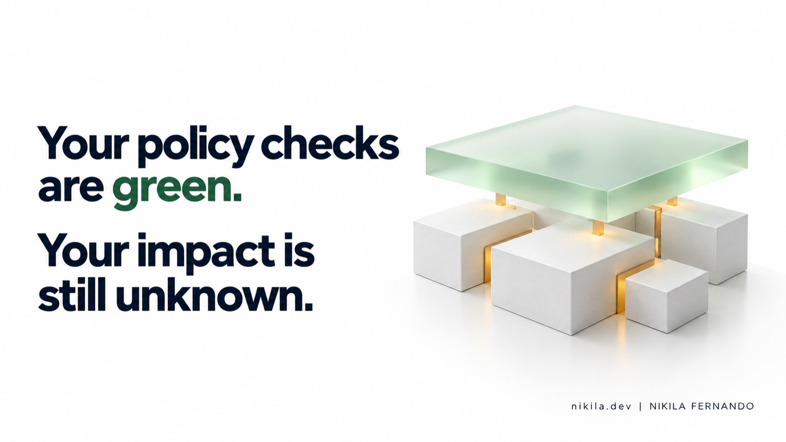
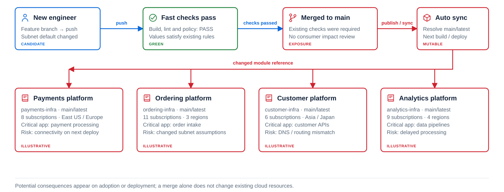
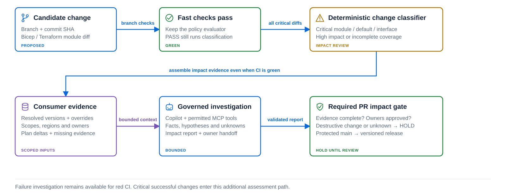

The build passes. Lint passes. Security scans pass. Your policy checks are green.

Everything required by the repository looks good. But there is still one question we may not have answered: **what happens when other teams consume this change?**

For a shared infrastructure repository, that question can reach much further than the pull request in front of us. It can reach payment services, ordering platforms, customer APIs, and analytics pipelines across different subscriptions, cloud accounts, and production regions.

This is the gap I want to explore in this series. In this first article, I focus on why downstream consumer impact matters and where governed agentic investigation can help. In the next article, I will go through an end-to-end implementation using GitHub Copilot, GitHub Actions workflows, and Model Context Protocol (MCP) tools.

## One shared repository, many production assumptions

Let's take a familiar platform engineering setup.

An organization maintains its custom Terraform modules, Bicep modules, or Helm charts centrally. Application teams consume those building blocks instead of each team creating its own networking, identity, and deployment configuration from scratch.

That is a powerful model. It gives the platform team a single place to maintain standards and gives application teams a consistent starting point. But it also creates a deep dependency relationship: a decision made in the shared repository can become a decision inherited by dozens of downstream repositories.

Those consumers are rarely identical:
- One team uses the defaults out of the box.
- Another overrides the network configuration.
- One production region has a dedicated DNS arrangement.
- Another service still depends on an older identity contract.
- Some teams upgrade immediately; others follow quarterly release windows.

The shared component may be consistent; the environments consuming it are not.

For Helm, the exact same concern applies to a common library chart or a shared dependency used by several application charts. In Helm terminology, a parent chart includes its dependencies as subcharts; a library chart supplies reusable template definitions. The dependency direction matters, but the operational concern is the same: a shared definition can influence several consumers. [1]

## A small default change can carry a large impact

Imagine a shared private-network module has a default for where it places a private endpoint. A proposed release changes that default from one approved subnet to another approved subnet.

The change is valid. It builds successfully. The security scan reports no issues. The current policy evaluator accepts both subnet choices, requires private access, and finds no violation in its evaluated configuration.

Now look at the consumers:

| Consumer | Evidence in this illustrative scenario | What the reviewer can conclude |
| :--- | :--- | :--- |
| **Payments** | Adopts the candidate and inherits the changed default | Assess the plan and validate the relevant connectivity assumptions |
| **Ordering** | Production still resolves the previous release | No exposure through this candidate yet; assess when it upgrades |
| **Customer APIs** | Adopts the candidate with an explicit subnet override | This particular default is overridden; verify the effective configuration and other changes |
| **Analytics** | Consumer is known, but current deployment evidence is missing | Impact remains unknown; obtain evidence from the owner |

For payments, the critical question is whether the proposed placement works with that consumer's routing, firewall rules, and DNS configuration. An approved subnet does not prove those relationships are correct. If adoption changes a required relationship without the corresponding network configuration, connectivity could be disrupted immediately upon rollout.

Ordering does not inherit that change while it remains pinned to the old release. The customer API override may remove exposure to this specific default change. Analytics cannot be called safe just because we could not inspect it.

> [!warning] Beware of Transitive Application Failures
> There can also be an indirect impact through runtime application dependencies. If ordering calls the affected payments service, an ordering transaction could fail even though ordering's infrastructure never adopted the new module. If an analytics pipeline relies on events from that transaction flow, processing could be delayed. Those runtime connections need their own evidence; a module consumer list alone does not establish them.

That is why I distinguish direct module exposure from possible impact through runtime dependencies. Version pinning can prevent a consumer from inheriting the module change while leaving its dependence on another service unchanged.

This is an illustrative scenario, not a report of an actual outage. A module merge alone does not change existing cloud resources. The change reaches production when a consumer resolves or adopts it and the relevant deployment runs. Even then, the outcome depends on its effective configuration and the resources involved.

The enterprise risk is the combination of a shared dependency, different consumer assumptions, and an incomplete understanding of adoption. A small diff can deserve a large review because of where that dependency is used. Recovery also follows those consumers: reverting the shared source does not automatically restore cloud resources already modified by downstream deployments.

## Green checks have a scope

I think we sometimes give a green check more meaning than the check actually carries.

A successful policy result tells us that the evaluated inputs satisfied the rules that ran. That is valuable evidence. But its meaning still strictly depends on which inputs, rules, and environments were evaluated.

A subnet allowlist answers whether a subnet is permitted. Consumer-specific evaluation answers whether using it changes an endpoint's placement and whether the necessary network relationships have been assessed. Those are fundamentally different questions.

The same applies far beyond networking:
- A Helm chart can render valid manifests while altering a workload's resource requests, scheduling constraints, or availability assumptions.
- An identity module can keep permissions within an approved boundary while changing an output format that consumers rely on.

Consumer tests, infrastructure plans, and integration checks can catch many of these issues. We should strengthen those controls wherever the relationship can be tested. But a scan of the shared module, using its own synthetic test fixtures, does not automatically become an assessment of every consumer.

> [!warning] What-If Analysis Has Blind Spots
> Even cloud preview tools have structural limits. Azure Bicep what-if can leave resources unevaluated or exclude resources when nested template analysis short-circuits. A reliable impact report must preserve those gaps rather than describe an incomplete preview as full coverage. [2]

## Versioning helps, but the upgrade still needs review

At this point, the standard platform engineering response is to version every module and pin the consumers. I agree with that direction wholeheartedly.

Exact version selection and immutable releases make adoption deliberate. A consumer that stays on an unchanged old release does not receive the candidate simply because it was merged.

> [!caution] The Danger of Mutable References
> Mutable references such as a moving branch or floating `latest` tag create a silent exposure path, because a future CI run or unattended schedule may retrieve changed content unexpectedly. Always pin to immutable semantic releases or commit SHAs.

Terraform supports version constraints for registry modules and Git references for Git-sourced modules. Bicep registry references include a module tag. These mechanisms identify what a consumer selects; release practices must also preserve the identity of published content. [3][4]

> [!note] Terraform Lockfile Scope: Providers vs Remote Modules
> There is a Terraform detail worth being precise about: `.terraform.lock.hcl` currently tracks provider selections, not remote module selections. Committing it does not, by itself, pin every shared module. Module version constraints and explicit Git tags still require deliberate discipline. [5]

Even with disciplined versioning, an application team eventually proposes an upgrade. At that point, we still need to understand what changes for its actual configuration.

A version number tells us which release is being selected. It does not tell us whether the upgrade preserves a payment platform's networking assumptions or an application's availability requirements. Versioning controls adoption; impact review informs the adoption decision.

## Where governed investigation with Copilot adds value

This is where I see a high-leverage role for agentic investigation.

I would give the investigation a specific, bounded job: **explain the proposed change against authorized consumer evidence, identify the relationships that need review, and make missing evidence visible.**

The fixed work should remain deterministic:
1. Resolve the module identity and commit SHA.
2. Read the maintained consumer inventory.
3. Record selected versions and overrides.
4. Collect relevant plan or rendered-manifest differences and available service dependency records.
5. Identify owners and deployment scopes.
6. Record which consumers were evaluated and which were not.

Then a Copilot-based investigator can work with that evidence. It can compare the diff with consumer contracts, explain why an inherited default matters, connect a plan change to a documented dependency, and request a targeted lookup when evidence is missing.

Model Context Protocol (MCP) can provide that access through narrowly scoped tools. For example, a tool could return the permitted consumer records, resolved versions, owner information, and plan references for a particular module and candidate commit. MCP itself does not discover the organization or establish authorization. The server and its credentials must enforce which repositories and records the investigator can access. [6]

For the example above, a concise, actionable report might say:

> **Payments** adopts the candidate and inherits the changed subnet default. Review the referenced plan and validate connectivity for the affected scope.  
> **Ordering** remains on the previous release.  
> **Customer APIs** override this default.  
> **Analytics** coverage is incomplete, so its impact remains unknown.

That report must cite the records behind each statement. If endpoint movement is not demonstrated by the plan, it must remain a possibility to evaluate. If a region was not assessed, the report must say so explicitly.

The value is a clearer review backed by evidence, especially when the relevant information is spread across repositories and artifacts. It gives owners a grounded starting point for decisions that would otherwise require them to reconstruct the dependency context manually.

## The investigation must run when CI succeeds

There is a critical trigger detail here.

An investigator that runs only after CI failure will miss this entire problem class. The ordinary checks are successful. The reason to investigate is the type, blast radius, and reach of the change.

For a critical shared repository, I would use a trusted deterministic classifier to identify changes that require consumer impact review. That includes changed defaults, interfaces, networking, identity, or deployment scopes. Known uncertainty about consumer coverage should also be visible to the review process.

Passing CI should not skip that classification.

The classifier does not need to ask a language model whether a protected module path is important. It can apply reviewed rules. The investigator then helps explain the contextual findings for changes that deserve the extra work.

## Governed means the boundaries are enforced

For me, the word *governed* has to describe the system around the agent.

The investigator should have access to the evidence it needs within an authorized scope. Cloud plan generation can happen in a separate controlled evaluator, with the agent reading its output. The agent should never inherit cloud deployment credentials just to explain a plan.

Repository content, logs, and tool responses must be treated as untrusted evidence. They must not be allowed to expand the investigator's permissions or redirect its outputs.

> [!important] Hard Security Invariants for Agentic Pipelines
> 1. **Read-Only Investigation:** The agent runs with read-level permissions on approved artifacts and schemas.
> 2. **Separate Writing Stage:** A dedicated, deterministic workflow stage delivers the report to the PR.
> 3. **No Autonomous Approvals:** The agent cannot approve PR merges, bypass required checks, or execute cloud deployments.
> 4. **Candidate SHA Binding:** Checks and reviews are cryptographically bound to the current commit SHA; any new push invalidates previous evidence.

GitHub Agentic Workflows documents a useful permission separation pattern: agent execution uses read-level access, while external writes are handled through separate, controlled output stages. That pattern supports governed investigation, but each installation still needs correctly scoped credentials and configuration. [7]

A report appearing on a pull request is also different from an enforced merge requirement. A required check must validate the current candidate's evidence, coverage, and required approvals. A new commit must not reuse approval for a previous candidate. Missing required evidence should hold the change for review rather than produce an automatic pass.

The model can support the decision. Repository controls and accountable human owners must enforce it. Consumer deployment gates still matter after the shared release is approved.

## Does every repository need this?

I would start with the repositories where shared changes have substantial consequences: networking foundations, identity modules, deployment templates, and common charts used by critical workloads.

Some repositories have a small dependency graph and comprehensive consumer tests. Deterministic evaluation may already provide the information reviewers need. Adding an agent there needs a clear benefit.

The stronger case is where a review requires interpretation across several sources, and where that work is currently slow, inconsistent, or easy to miss. Even there, useful consumer records are a prerequisite. An agent cannot compensate for an inventory nobody maintains.

There is also a practical cost:
- Collect and normalize evidence before asking the agent to investigate.
- Bound its tool access, runtime, and retries.
- Use it to resolve the contextual question that remains, rather than repeatedly fetching information a collector could provide once.

I would measure value by whether reviews become clearer and whether important gaps are surfaced earlier. A longer AI-generated report is not evidence of a better review.

## What I want the next check to mean

When a shared-module pull request is green, I want to understand both the compliance result and the consumer impact evidence behind the proposed release.

Which consumers would adopt it? Which inputs change? Which scopes were assessed? What remains unknown? Who needs to review the result before release or deployment?

Governed investigation with GitHub Copilot and MCP can help bring those answers together. Its usefulness depends on the evidence available and the controls that turn that evidence into an accountable review.

In the next article, I will build that path step by step: classify critical changes, collect authorized consumer evidence, expose bounded context through MCP, run the Copilot investigator, and connect its report to an enforced review gate.

For now, the question I want to leave with platform teams is simple: **when your policy checks are green, how much of the downstream impact have you actually assessed?**

## Explore the scenario

Switch between the risk path, consumer evidence, and governed review below. The interactive workbench demonstrates the proposed pattern:

  <iframe 
    src="./shared-module-impact-interactive.html" 
    title="Shared module impact: green checks, consumer evidence and governed review" 
    loading="lazy" 
    sandbox="allow-scripts allow-same-origin" 
    allow="fullscreen"
    allowfullscreen
    style="width: 100%; aspect-ratio: 16 / 9.4; min-height: 560px; border: 1px solid var(--lightgray, #d8e0ea); border-radius: 8px; background: #ffffff; box-shadow: 0 4px 20px rgba(0,0,0,0.08);"
  ></iframe>
  

    💡 <em>Interactive Architecture Workbench:</em> Click any component to inspect its contracts, press 1-2-3 for view switching, or Space to step through.
    <a href="./shared-module-impact-interactive.html" target="_blank" rel="noopener" style="font-weight: 600; text-decoration: underline;">Open full screen ↗</a>
  

## References

1. [Helm: Library charts](https://helm.sh/docs/v3/topics/library_charts/) and [chart dependencies](https://helm.sh/docs/topics/charts/).
2. [Microsoft Learn: Bicep what-if, including analysis limitations](https://learn.microsoft.com/en-us/azure/azure-resource-manager/bicep/deploy-what-if).
3. [HashiCorp: Using modules, registry versions and Git references](https://developer.hashicorp.com/terraform/language/modules/configuration).
4. [Microsoft Learn: Bicep modules and registry references](https://learn.microsoft.com/en-us/azure/azure-resource-manager/bicep/modules).
5. [HashiCorp: Dependency lock file and its scope](https://developer.hashicorp.com/terraform/language/files/dependency-lock).
6. [GitHub Agentic Workflows: Using MCP servers](https://github.github.com/gh-aw/guides/mcps/).
7. [GitHub Agentic Workflows: Security architecture and permission separation](https://github.github.com/gh-aw/introduction/architecture/).

## Related Posts

- [[devops/kubernetes-v1-37-sneak-peek|Kubernetes v1.37 Sneak Peek: What Platform Engineers Should Actually Care About]]
- [[devops/azure-application-gateway-for-containers|Azure Application Gateway for Containers]]
- [[devops/kubernetes-tls-certificate-management|Kubernetes TLS Certificate Management: How Cluster Certificates Work]]
