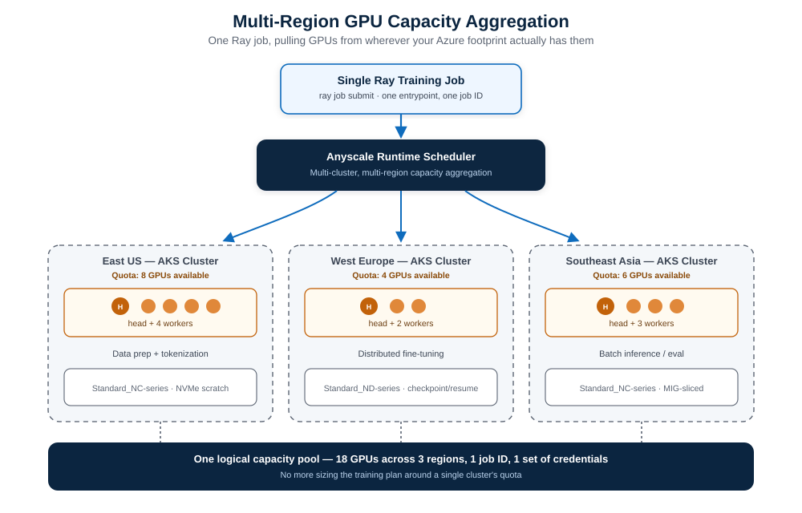

So — running Kubernetes. Running AI workloads on Kubernetes. If that sentence alone makes your shoulders tense up a little, you already know where this post is going.

I spend most of my working life moving YAML between AWS EKS and GKE, keeping Concourse pipelines from falling over, and explaining to onboarded teams on our internal platform why their pod just got OOMKilled. So when a LinkedIn post tagged `#MSBuild` and `#anyscale` showed up in my feed talking about "Managed Ray natively on Azure," I did what any self-respecting platform engineer does: I opened a dozen tabs and went down the rabbit hole.

What I found is genuinely one of the more interesting Kubernetes-adjacent announcements out of Build 2026 — **Anyscale on Azure**, now in public preview. It isn't a new product bolted on top of Azure. It's Anyscale's managed Ray platform — control plane, operator, and the proprietary Anyscale Runtime — wired directly into the Azure Kubernetes Service clusters your platform team already runs, with Entra ID, Azure RBAC, and Azure billing baked in from day one.

This is my "today I learned" on what it actually is, how it's architected under the hood, where it fits next to the AKS GPU primitives we already use, and the questions I'd ask before pointing a production workload at it.

## Running AI on Kubernetes: the problem nobody fully solved

Before Anyscale, if you wanted distributed Python — Ray — on Kubernetes, your options were roughly:

- Run **KubeRay** yourself: install the operator, write `RayCluster` and `RayJob` CRDs, handle autoscaling, GPU scheduling, and upgrades by hand.
- Buy a fully Anyscale-hosted cloud, outside your own VPC/VNet, and ship your data out to it.

Both work. Neither is free of friction. Self-managed KubeRay means your platform team owns yet another operator lifecycle, on top of ArgoCD, cert-manager, external-dns, and whatever else is already living in your cluster. A fully hosted cloud means your proprietary training data, your checkpoints, and your model weights leave your tenant — a non-starter for a lot of regulated or cost-sensitive enterprises.

Anyscale's own framing of the problem, from their public preview announcement, comes down to three recurring complaints platform teams raise: GPU capacity is fragmented across regions and SKUs, training data and artifacts are scattered across the AI lifecycle, and operational overhead (identity, observability, upgrades) piles up cluster by cluster. Anyscale on Azure is built to answer those three things specifically, without asking you to leave Kubernetes or leave Azure.

## What "Anyscale on Azure" actually is

The official Microsoft Learn description is refreshingly precise: Anyscale on Azure is a managed platform for running distributed Python workloads on Ray, deployed directly onto your own AKS cluster, integrated with the Azure services your team already uses.

A short timeline, since the announcement history matters here:

| Date | Milestone |
|---|---|
| Nov 4, 2025 | Private preview announced — Microsoft and Anyscale co-engineered service |
| Jun 2, 2026 | **Public preview** announced at Microsoft Build 2026 |
| Today | Available in a limited set of Azure regions, no SLA yet |

Brendan Burns — Kubernetes co-creator and Azure's CVP for Cloud Native — put the pitch simply: Ray on AKS gives customers a path to build AI inside their own Azure environment with more control over cost. That's the whole thesis in one sentence: stop renting intelligence through token-metered APIs, start owning the compute that produces it, without giving up the Kubernetes operating model your team already trusts.

It's worth being precise about the distinction the original LinkedIn post made, because it's the one most people get backwards: **Anyscale on Azure is the managed platform** — the console, the scheduler, the Kubernetes operator, the billing integration. **Ray is the open-source engine running underneath it.** You can absolutely keep running open-source Ray and KubeRay yourself; Anyscale on Azure is for the teams that want the managed layer (and the performance-optimized Anyscale Runtime) without giving that up.

## The architecture: two planes, one trust boundary

This is the part that actually matters for anyone who has to sign off on a security review. Anyscale on Azure splits cleanly into a **control plane** and a **data plane**, and the boundary between them is the whole design.

- **Control plane** — hosted by Anyscale, inside an Anyscale-owned Azure tenant. It runs the Anyscale console, the scheduling and job-management APIs, and the monitoring/metrics stack (Grafana dashboards, log aggregation). You talk to it through the Azure portal, the Anyscale CLI, or the SDK.
- **Data plane** — runs entirely inside *your* Azure subscription, on *your* AKS cluster. Your Ray clusters, your container images, your training data, your checkpoints — none of it leaves your tenant.

The critical detail: the control plane **never** opens a connection into your cluster. Instead, an Anyscale Kubernetes operator — installed as an AKS extension during cloud creation — polls the control plane endpoint for pending work, executes it locally (spinning up `RayCluster`-equivalent resources, pods, services, ingress), and reports health and telemetry back. Every network hop originates from your side. No inbound firewall rules, no exposed ports waiting for Anyscale to reach in.

Here's how that looks end to end:


*Figure 1 — Control plane and data plane, and the one-way polling relationship between them.*

A quick component-ownership table, because this is exactly the kind of thing that ends up in a cloud architecture review doc:

| Component | Lives in | Owned by |
|---|---|---|
| Anyscale console | Anyscale Azure tenant | Anyscale |
| Scheduling & job APIs | Anyscale Azure tenant | Anyscale |
| AKS cluster | Your subscription | You |
| Anyscale Kubernetes operator | Your AKS cluster | Anyscale, installed by the Azure portal |
| Ray clusters | Your AKS cluster | You |
| Blob Storage / ADLS | Your subscription | You |
| Azure Load Balancer | Your subscription | You |

If you've spent any time setting up cross-account IRSA roles or OIDC federation between an EKS cluster and a central AWS account, this pattern will feel familiar — it's the same "operator polls outward, never gets polled" trust model, just expressed through Entra workload identity instead of an OIDC provider trust policy on an IAM role.

## Identity and governance: it borrows trust you've already built

Anyscale on Azure doesn't introduce a parallel identity system, and that's deliberate. Authentication runs through **Microsoft Entra ID** using a standard OAuth 2.0 authorization-code flow with PKCE — your team signs in with the same credentials they use for the rest of Azure, and any conditional-access policy requiring managed devices applies to the Anyscale console too.

Authorization runs through **Azure RBAC**, with three built-in roles shipped out of the box:

| Role | What it grants |
|---|---|
| Anyscale Platform Administrator | Full control, including quota/budget admin actions (subscription scope only) |
| Anyscale Platform Contributor | Read/write on clouds, projects, workspaces, jobs, services, compute configs, images |
| Anyscale Platform Reader | Read-only — the minimum needed just to sign in to the console |

You can assign these at any scope in the Azure hierarchy — subscription, resource group, cloud, project, or individual resource — and everything below inherits it, same as any other Azure RBAC assignment. There's also a published set of `Anyscale.Platform/*` actions if you want to build a narrower custom role.

Underneath user-facing RBAC, the portal provisions **two managed identities** per cloud resource when you create it:

1. An **operator identity** — what the Anyscale operator itself uses to provision nodes and manage Ray cluster infrastructure in your subscription.
2. A **cluster identity** — the default identity all Ray workloads share, unless you map specific workloads or projects to their own user-assigned identities for tighter blast-radius control.

And because it's an Azure-native resource provider rather than a bolted-on SaaS billing relationship, Anyscale consumption draws down from your existing **Microsoft Azure Consumption Commitment (MACC)**, shows up in Azure Cost Management, and is queryable through Azure Resource Graph alongside the rest of your subscription's resources. For a platform team, that single fact removes an entire category of "shadow IT spend" conversation.

## Networking: egress-only, on purpose

The networking model follows directly from the control-plane/data-plane split, and it's documented in unusual detail for a preview product. Four traffic flows cover everything:

| # | Flow | What it's for |
|---|---|---|
| 1 | Client → control plane | Console, CLI, SDK calls via `console.azure.anyscale.com` |
| 2 | Client → AKS cluster | Dashboard access, job submission, service requests via Azure Load Balancer |
| 3 | AKS cluster → control plane | Operator polling, telemetry, health reporting |
| 4 | AKS cluster ↔ Azure resources | Blob/ADLS and ACR access |

All of it is **outbound from your cluster**. There's no flow where Anyscale's control plane initiates a connection into your AKS nodes. For locked-down environments, you point your NAT Gateway or Azure Firewall at a documented list of egress domains (`*.azure.anyscale-cloud.dev` for control-plane polling, `*.i.azure.anyscaleuserdata.com` for Ray dashboard/Jupyter/VS Code access, `*.s.azure.anyscaleuserdata.com` for Anyscale Services traffic), and you're done. TLS certificates are managed and rotated automatically — at least every three months — and the platform supports fully private clusters with no public node IPs, behind an internal load balancer and a private DNS zone reachable over VPN or ExpressRoute. One hard requirement worth flagging early: ingress has to be a Layer 4 (TCP) load balancer — the standard SKU Azure Load Balancer qualifies, but **Application Gateway is explicitly not supported** as the primary ingress path.

## The Anyscale Runtime: what you get beyond open-source Ray

This is the piece that's easy to gloss over but is genuinely the commercial heart of the product. The **Anyscale Runtime** is a fully Ray-compatible engine — no code changes required to adopt it — that Anyscale positions as meaningfully faster and more stable than self-managed open-source Ray, especially under three conditions: heavy multimodal data processing (video, image, text, document pipelines), large distributed training runs, and latency-sensitive serving like agentic applications.

The specific reliability features that matter most for anyone who has babysat a multi-day training job:

- **Job checkpointing** — pause and resume batch processing without starting over.
- **Mid-epoch resume** — resume an interrupted training run partway through an epoch, not just from the last full-epoch checkpoint.
- **Dynamic memory management** — actively reduces object-store spilling and out-of-memory errors during training and inference, which in my experience is the single most common reason a Ray job dies at 2 a.m.

Anyscale's own marketing numbers are bold — they claim up to 4 times faster experimentation and up to 90% lower AI total cost of ownership compared to a fragmented stack combining separate data-processing engines with hosted model APIs, with multimodal feature processing cited as a particular bright spot for performance gains. Take vendor benchmarks the way you'd take anyone's vendor benchmarks — useful as a directional signal, not a number to put in a capacity plan without your own load test.

What I find more interesting than the percentages is how deliberately Anyscale on Azure positions itself as a layer *on top of* the AKS AI primitives Azure already shipped, rather than a replacement for them. It composes with:

- **Dynamic Resource Allocation (DRA)** for GPU scheduling
- **Multi-Instance GPU (MIG)** for slicing a single GPU across workloads
- **NVIDIA Dynamo** for multi-node inference
- **KAITO** for fine-tuning and RAG workflows
- **Azure Container Storage v2** for stateful AI workloads

None of that requires a forked or special AKS cluster type. It's standard AKS, with an extra operator and a managed control plane sitting on top.

## Multi-region GPU aggregation: solving the quota problem

If you've ever tried to get a training run's worth of GPU quota in a single Azure region and hit a wall, this is the feature that's actually new and Kubernetes-native in a way I hadn't seen elsewhere. Anyscale on Azure's headline scaling capability is **multi-cluster, multi-region capacity aggregation**: a single Ray job can pull workers from multiple AKS clusters, in multiple Azure regions, as one logical compute pool — instead of you sizing your entire training plan around whatever one cluster happens to have free.



*Figure 2 — One job ID, one set of credentials, GPU capacity pulled from wherever your Azure footprint actually has it.*

Mechanically, this works because "Anyscale cloud" and "AKS cluster" aren't a 1:1 mapping. A single Anyscale cloud can register multiple **cloud resources**, and each cloud resource maps to one Anyscale operator on one AKS cluster — which can sit in a completely different region or even a different virtual network. Worth flagging honestly, though: during public preview, Anyscale explicitly recommends sticking to a single default cloud resource per cloud, and multi-resource cloud support comes with real caveats — no cross-resource autoscaling or scheduling yet, and compute configs only target the default resource unless you specify one explicitly. The multi-region story is clearly the direction the product is heading, but in preview it's "supported with training wheels," not "flip a switch and your job spans three continents today."

## Fifteen minutes with the CLI

I always trust an announcement more once I've seen the actual commands. Here's the abbreviated path from zero to a running Ray job, pulled together from the official quickstart.

**1. Trust the Anyscale control plane in your tenant (one-time per tenant):**

```bash
az ad sp create --id 086bc555-6989-4362-ba30-fded273e432b
```

**2. Spin up an AKS cluster with OIDC issuer and workload identity enabled** — both are required, not optional, since the operator's managed identity depends on them:

```bash
az aks create \
  --resource-group <resource-group> \
  --name <cluster-name> \
  --location <location> \
  --node-count 3 \
  --node-vm-size Standard_D4s_v5 \
  --enable-oidc-issuer \
  --enable-workload-identity \
  --generate-ssh-keys
```

**3. Create the Anyscale cloud resource** through the Azure portal (search "Anyscale clouds" in the global search bar) — this is a portal-only step in preview, no CLI equivalent yet. The portal provisions storage, the two managed identities, an optional ACR, and installs the operator as an AKS extension automatically, in roughly 5–8 minutes.

**4. Assign yourself the Anyscale Platform Contributor role** on the cloud resource — subscription Owner doesn't carry over to Anyscale's resource provider, and skipping this step gets you a confusing `404` instead of a `403` the first time you try to submit a job.

**5. Submit a Ray job** once your cloud verifies as healthy:

```python
# main.py
import ray

@ray.remote
def process(x):
    return x * 2

result = ray.get([process.remote(x) for x in range(5)])
print("The job result is", result)
```

```yaml
# job.yaml
name: my-first-job
working_dir: .
entrypoint: python main.py
max_retries: 1
```

```bash
anyscale job submit -f job.yaml --cloud <cloud-name>
```

That last command hands you back a console URL to watch the job run. From a cold subscription to a scheduled Ray job, realistically under thirty minutes once your quota and prerequisites are sorted — most of that time is the AKS cluster provisioning, not anything Anyscale-specific.

## Does this replace KubeRay?

No, and Microsoft and Anyscale are both explicit about this. Open-source Ray on AKS via KubeRay continues to be fully supported as its own path. Anyscale on Azure exists for teams who specifically want the managed control plane, the Anyscale Runtime's performance and reliability layer, and Azure-native governance on top of Ray — not as a deprecation notice for everyone currently running KubeRay themselves. If your KubeRay setup is stable, well-instrumented, and your team isn't drowning in operational toil, there's no forcing function here. If KubeRay maintenance, GPU quota juggling, and identity sprawl across clusters *are* eating your week, this is squarely the product built for that pain.

## Public preview: the honest limitations list

No deep dive is complete without the fine print, so here's what's genuinely not there yet:

- **AKS only.** No VM-stack deployment, no Anyscale-hosted clouds during preview.
- **Portal-only cloud lifecycle.** `anyscale cloud setup`, `register`, `delete`, and `resource create/delete` aren't supported from the CLI — cloud creation and deletion go through the Azure portal exclusively.
- **A few workload CLI commands are missing:** `workspace_v2 ssh`, `workspace_v2 pull`, and `image archive`.
- **Limited region availability,** with an access-request process for regions not yet enabled.
- **Feature gaps versus Anyscale's full platform:** no Global Resource Scheduler / machine pools, no Anyscale Services, no lineage tracking, no job queues, and several console org settings (billing, budgets, cost analysis, resource notifications) aren't wired up yet.
- **No SLA**, as you'd expect for any Azure preview feature.

None of this is unusual for a public preview, but if you're the one writing the architecture decision record, it's the section that determines whether this goes in a production runbook or a sandbox experiment for now.

## My take, from the platform engineering chair

I run multi-cloud Kubernetes for a living — AKS isn't even in my usual rotation, EKS and GKE are — but the shape of this announcement is one I recognize immediately. The split-plane, operator-polls-outward model is the same trust pattern I lean on constantly with IRSA and OIDC federation across AWS accounts: never let the central control point reach into the workload account, make the workload account the one doing the asking. Seeing Azure ship that as a first-class, documented pattern for a third-party-but-native AI compute platform is a good sign for where "AI on Kubernetes" is heading generally — less bespoke operator wrangling, more declared trust boundaries.

The part I'd actually pilot first, if I were greenlighting this for a platform team, isn't the performance claims — it's the **multi-region GPU aggregation**, specifically because GPU quota fragmentation is a real, unglamorous, weekly problem, and "one job ID across three regions" is the kind of capability that quietly removes an entire category of capacity-planning meetings. I'd also want to see, in practice, exactly how the per-workload managed identity mapping behaves once a few different teams are running RL post-training and batch inference on the *same* cloud resource — that's usually where "managed permissions" marketing copy and Tuesday-afternoon reality part ways.

And I'd genuinely love an AWS equivalent of this pattern for EKS. Until then, this is the cleanest write-up I've seen of what "Kubernetes-native, Azure-governed, vendor-optimized Ray" looks like end to end.

## TL;DR

| What | Anyscale on Azure |
|---|---|
| Status | Public preview, announced at Microsoft Build 2026 (June 2, 2026) |
| Runs on | Standard Azure Kubernetes Service — no fork, no special cluster type |
| Architecture | Split control plane (Anyscale-hosted) / data plane (your subscription) |
| Identity | Microsoft Entra ID SSO, Azure RBAC (3 built-in roles), 2 managed identities per cloud resource |
| Networking | Egress-only; operator polls outward, no inbound rules needed |
| Differentiator vs. open-source Ray | Anyscale Runtime — checkpointing, mid-epoch resume, dynamic memory management, claimed performance gains |
| Headline scaling feature | Multi-cluster, multi-region GPU capacity aggregation |
| Billing | Flows through Azure, MACC-eligible |
| Replaces KubeRay? | No — parallel option, not a deprecation |

